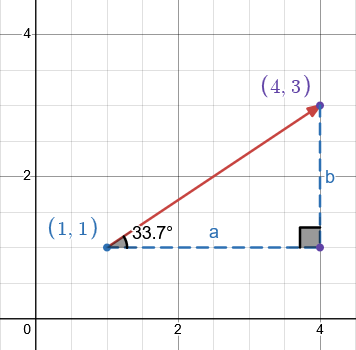

# Components and Orientation

On this page, you’ll learn about the components of a vector, along with various formulas to compute its components and magnitude.

## Components of a Vector

In a Cartesian plane, the initial and terminal points of a vector each have x and y coordinates. **This forms a right triangle, where the vector is the hypotenuse.**

The components of a vector allow us to describe it without directly using its magnitude or direction. To find the components of a vector:
$$
\begin{aligned}
\overrightarrow{AB} &= (\Delta x, \Delta y) \\
                   &= (x_2 - x_1, y_2 - y_1) \\
                   &= (a, b)
\end{aligned}
$$

## Relations Between Components and Trigonometry

Since a vector acts as the hypotenuse of a right triangle, we can use the Pythagorean theorem to find its magnitude:
$$
||\vec{v}|| = \sqrt{a^2 + b^2}
$$

If the direction of the vector is measured relative to the x-axis, we can compute it using the following trigonometric ratios:
$$
\begin{aligned}
cos\theta &= \frac{a}{||\vec{v}||} \\[10pt]
sin\theta &= \frac{b}{||\vec{v}||} \\[10pt]
tan\theta &= \frac{b}{a} 
\end{aligned}
$$

## Examples

1. Find the components of the vector. 
From the image above, let’s call the vector 𝒗. Its components are:
$$
\begin{aligned}
\vec{v} &= (\Delta x, \Delta y) \\
                   &= (4 - 1, 3 - 1) \\
                   &= (3, 2)
\end{aligned}
$$
2. Find the magnitude of 𝒗.
$$
\begin{aligned}
||\vec{v}|| &= \sqrt{a^2 + b^2} \\
&= \sqrt{3^2 + 2^2} \\
&= \sqrt{13}
\end{aligned}
$$
3. Find the components given the magnitude and direction. 
Suppose the vector has a magnitude of 10 units and a direction of 33.7°.
$$
\begin{aligned}
cos\theta &= \frac{a}{||\vec{v}||} \\[7pt]
cos33.7 &= \frac{a}{10} \\[7pt]
0.83 &≈ \frac{a}{10} \\[7pt]
8.3 &≈ a \\[15pt]

sin\theta &= \frac{b}{||\vec{v}||} \\[7pt]
sin33.7 &= \frac{b}{10} \\[7pt]
0.55 &≈ \frac{b}{10} \\[7pt]
5.5 &≈ b \\[15pt]

\vec{v} &≈ (8.3, 5.5)
\end{aligned}
$$

## Videos with similar information (optional)