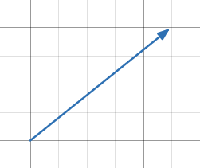

# Introduction to Vectors

On this page, you’ll learn the definition of a vector as well as some fundamental concepts related to it.

## Definitions
**Vector: An object that has a magnitude and a direction**. Geometrically it can be represented as an arrow, where the length of the arrow is its magnitude and the arrowhead indicates its direction.

- Here's two different ways to represent a vector: 
$$\vec{v} \enspace and \enspace \overrightarrow{AB}$$

- In the second notation, A is the **initial point** (the starting location) and B is the **terminial point** (the ending location)

**Magnitude:** The distance between the initial point and the terminal point. In other words, **the length of the vector**.

- The magnitude of the vector 𝒗 can be represented as:
$$||\vec{v}||$$

**Direction: The angle of the vector**, often measured with respect to the x-axis.

- the direction of a vector can be represented by an angle: 
$$\theta$$

- θ is always between 0° and 360°.

## Comparing vectors and basic information

In a Cartesian plane, vectors do not have fixed coordinates (x, y); they can be freely translated. The magnitude and direction of a vector cannot change, but its position can.

- Equal vectors: Two vectors are equal if they have the same magnitude and direction.

- Parallel vectors: Two vectors are parallel if they have the same direction.

- Anti-parallel vectors: Two vectors are anit-parallel if they have opposite directions.

## Videos with similar information (optional)

