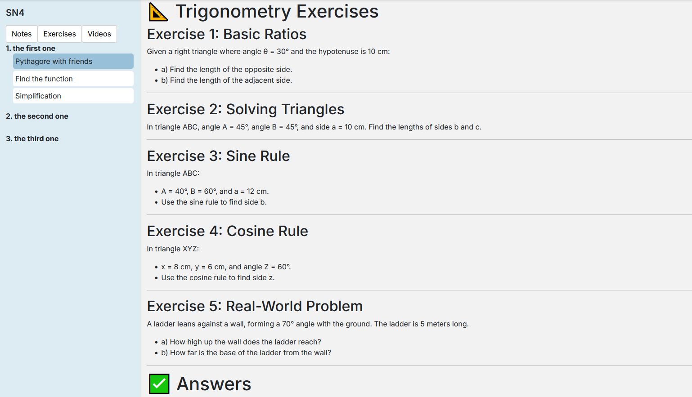
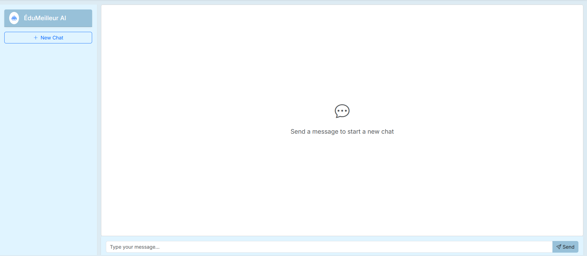

# EduMeilleur

[Short tagline or slogan]

## 📘 Description

ÉduMeilleur is an educational platform designed for secondary school students. Many students struggle with the advanced courses they’re required to take to pursue their career goals. Finding help can be challenging, tutors are expensive, support from teachers may not always be enough, and students often lack access to sufficient practice materials. Our platform addresses all of these issues.

After selecting a subject, students can access detailed written notes, educational videos, and a revision cheat sheet for each chapter —all in one place. They’ll also find a variety of exercises tied to each chapter, complete with answers for self-assessment. A dedicated video page offers extra resources, including important explanations, helpful insights, and study tips.

Students can also reach out to us via the contact page to ask questions. They can include images or attachments, and our team of teachers will respond with reliable answers.

Additionally, the site features an AI chatbot to assist with quick and simple questions.

Our Explore page, currently in development, will allow students and teachers to share notes and exercises with the community.

## 🌐 Live Website

Hosted on [RaspPi_WebHost](https://github.com/AdanRiasat/RaspPi_WebHost), currently only on LAN

Will be fully published soon.

## 🚀 Features

- Notes, exercises, and videos served with markdown files provided by the backend.

- Two carousels on the home page: one with swipe functionality and the other with navigation arrows.

- Loading screen during API calls using ngx-spinner.

- Chatbot powered by an OpenRouter API key.

- Users can send images and attachments along with their questions on the Contact Us page.

- Website will be fully translated into English and French (translation not yet implemented).

## 🛠️ Tech Stack

- Frontend: Angular
- Backend: ASP.NET CORE
- Database: PostgreSQL
- Hosting: NGINX, Raspberry Pi 4

## 📚 Lessons Learned

This was my first experience developing a full-stack web application entirely from scratch. Setting up the backend, frontend, dependencies, and database was a significant initial challenge, but it laid the foundation for rapid feature development.

I learned the importance of considering performance, code quality (DRY principles), and security from the start. Factors that aren’t as heavily emphasized in school projects but are critical when you’re fully responsible for the product.

The project’s scope quickly grew, showing me how large-scale applications require continuous iteration and why such work is often distributed across entire teams.

## 📝TODO

- Replace all placeholders
- Create real notes 
- Add error messages to edit-profile
- Make more tests on the backend
- Replace hardcoded teacher pfps with real ones dynamicaly
- Add logo
- Explore page
- Improve nav-bar design
- Fix infinite loading screen when server is off
- Translate website to english and french
- Disconnect user when token is expired
- Add multiple sign up options